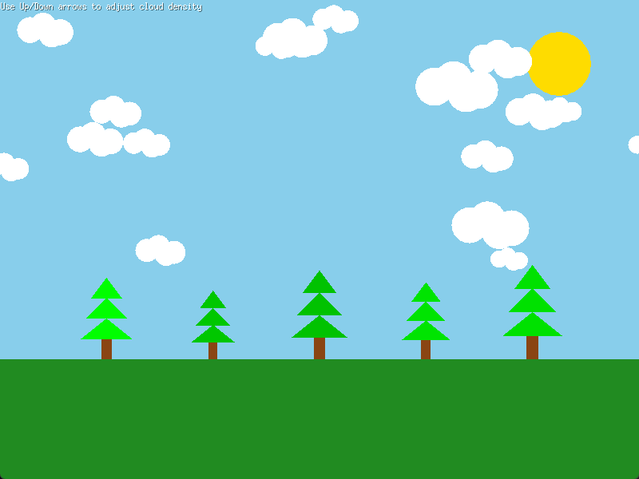

# Cloud Generation App

A perpetual motion cloud generation application written in Go using the [Ebiten](https://github.com/hajimehoshi/ebiten) game engine.

## Features

- Dynamic cloud density control
- """"Realistic"""" cloud rendering with varying sizes and opacity levels

## Controls

- **Up Arrow**: Increase cloud density (adds more clouds)
- **Down Arrow**: Decrease cloud density (removes clouds)
- **ESC**: Exit the application

## Requirements

- Go 1.16 or higher
- Ebiten v2 game engine (automatically installed via go modules)

## Installation

```bash
# Clone the repo,
# Install dependencies with
go mod tidy
```

## Running the Application

```bash
go run main.go
```

The application will open in a new window with an initial cloud density of 20%. Use the arrow keys to adjust the density to your preference.

## Demo
